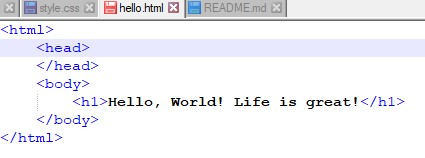
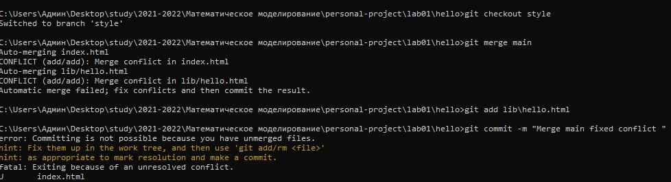
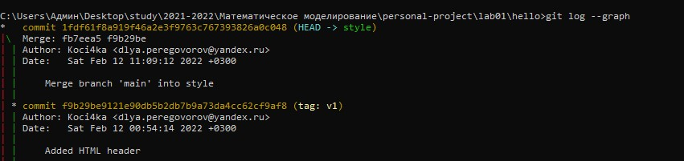

**Лабораторная  работа 1. Работа с Git** 
**Выполнила студентка группы НФИбд-03-19 Попова Юлия Дмитриевна 1032192876** 

**Цель работы: познакомиться с возможностями Git, научиться работать с MArkdown**

**1.1 Подготовка** 
Вначале нам необходимо подготовить окружение. Для этого мы устанавливаем имя и электронную почту, с которых будет вестись наша работа. К тому же определяем параметры для корректной работы с текстовыми файлами.

**1.2 Создание проекта**
Создаём проект hello, в котором создаём файл hello.html. Записываем в файл произвольный текст, например, “Hello, World!”

**1.3 Внесение изменений**
Изменяем текст в файле hello.html. Проверяем состояние репозитория - изменения ещё не добавлены в индекс.

**1.4 Индексация изменений**
Добавляем изменения и проверяем снова. После этого совершаем коммит без метки -m.

Редактируем текст снова, обновляем изменения в индекс. После этого еще раз редактируем файл. Получаем два состояния: одно изменение в индексе готово к коммиту, второе- нет. Делаем изменения в индексе. Проверив статус, совершаем коммит.

Далее произвольно берем коммит, копируем его хэш. Совместно с командой git checkout копируем в текущий репозиторий. Содержимое файла в выбранном коммите отличается от предыдущего.

Возвращаемся к текущей версии командой git checkout main и проверяем содержимое файла.

Создаем тэг для текущей версии - v1. Чтобы перейти к предыдущей версии применяем команду git checkout v1~1.

**1.5 Отмена локальных изменений до индексации**
Переходим в последнюю версию (версия v1) и изменяем файл.

Чтобы отменить изменения применяем команду git checkout hello.html. Изменения отменены.

**1.6 Отмена проиндексированных изменений перед коммитом**
Проделываем сначала те же шаги, как и в пунтке 1.5, добавив изменения в индекс. Чтобы отменить ненужные изменения применяем команду git reset HEAD helllo.html, после проделываем те же шаги, как в и пунтке 1.5

**1.7 Отмена коммитов**
Изменяем файл hello.html и делаем ненужный коммит. Чтобы отменить текущий, создаем еще один коммит. После проверяем логи.

**1.8 Удаление коммитов из ветки**
Несмотря на то, что мы отменили коммит, в логах осталось. Очистим при помощи сброщика мусора. Отметим последнюю ветку тегом oops, чтобы не ошибиться. Тем не менее после удаления коммиты можно увидеть в расширенных логах.

**1.9 Удаление тэга oops**
Удаляем тэг oops, делаем проверку истории коммитов - всё чисто, ненужные комиты удалены.

**1.10 Внесение изменений в коммиты**
Записываем в комментарии автора и коммитим. После добавляем электронную почту, изменяя текущий коммит.

Применяя команду git log, убеждаемся, что коммит только один.

**1.11 Перемещение файлов**
Перемещаем файл hello.html в каталог lib

**1.12 Второй способ перемещения файлов**
Другой вариант перемещения файла

**1.13 Подробнее о структуре**
Добавили файл index.html, сделали коммит.

**1.14 Git внутри: каталог .git**
Командой git -C .git посмотрели каталог .git.

Узнали файл конфигурации, ветки и теги, файл HEAD.

**1.15 Работа непосредственно с объектами git**
Вывели последний коммит командой git log --max-count=1, вывели последний коммит с помощью sha1 хэша, зато дерево каталогов, ссылку на который взяли в коммите. Также вывели каталог lib, файл hello.html

**1.16 Создание ветки**
Файл hello.html нужно сделать более выразительным. Для этого создали ветку style, добавили файл style.css, отредактировали файл hello.html, чтобы применить стили, и обновили файл index.html, что он также применял style.css.

**1.17 Навигация по веткам**
Есть две ветки, сначала переключились на ветку main(master), проверили файл hello.html безстилей, затем вернулись к ветке style и проверили файл hello.html со стилями.

**1.18 Изменения в ветке main (master)**
Создали файл README.md, записали строку в этот файл.
 

**1.19 Коммит изменений README.md в ветку main (master)**
Сделали коммит изменений README.md, проверили текущие ветки и их отличия командой git log --graph --all. Команда вызывает построение дерева коммитов с помощью простых ASCII символов, метка --all говорит о том, что мы просмотрели все ветки.

**1.20 Слияние (объединение)**
Вернулись в ветку style и выполнили слияние main (master) co style. Таким образом перенесли изменения из двух веток в одну.

**1.21 Создание конфликта**
Вернулись в ветку main (master) и произвели изменения в файле hello.html, сделали коммит. После посмотрели логи: последнее изменение в main (master)  конфликтует с некоторыми изменениями в style.

**1.22 Разрешение конфлитков**
Вернулись в ветку style и произвели попытку объединить с веткой master (main), возник конфликт. Открыли файл hello.html, устранили конфликт вручную

**1.23 Сброс ветки style**
Вернулись к ветке style перед слиянием с main (master), обозначили последний коммит перед слиянием и сбросили ветку style к этому коммиту, в логах нет коммитов слияний.

**1.24 Сброс ветки main (master)**
Вернулись к ветке main (master) перед кофликующими изменениями. Сбросили ветку к коммиту "added readme"

 

**1.25 Перебазирование**
Использовали команду git rebase, вместо git merge. И перенесли изменения из ветки main (master) в ветку style. Конечный результат перебазирования схож с результатом слияния, но дерево коммитов значительно отличается. Рекомендуется использовать git rebase для кратковременных, локальных веток, а слияние для веток в публичном репозитории.

**1.26 Слияние в ветку main (master)**
Объединили изменения style в ветку main (master). Ветки стали идентичны.

**1.27 Клонирование репозиториев**
Сначала нужно перейти в рабочий каталог. Далее применили команду clone, чтобы создать клон репозитория.

**1.28 Просмотр клонированного репозитория**
Перешли в клонированный репозиторий, файлы совпадают с исходным репозиторием. Также просмотрели историю клонированного репозитория, она идентична исходной.

**1.29 Что таке origin?**
У клонированного репозитория по умолчанию имя удаленного репозитория. 
Удаленные репозитории полностью могут заменить репозиторий на машине. По умолчанию принято указывать origin в качестве имени первичного централизованного репозитория, если таковой имеется.

**1.30 Удаление ветки**
Чтобы увидеть все ветки, в том числе удаленные, выполнили команду git branch -a

**1.31 Изменение оригинального репозитория**
Внесли изменения в оригинальный репозиторий. Чтобы извлечь изменения применили команду git branch. В клонированном репозитории есть все коммиты из оригинального репозитория, но они не интегрированы в локальные ветки клонированного репозитория. Команда git fetch извлекает новые коммиты из удаленного репозитория, но не будет сливать их с вашими наработками в локальных ветках. Просмотрев файл README.md, поняли, что он не изменился.

**1.32 Слияние извлеченных изменений**
Объединили извлеченные изменения в локальную ветку main (master) командой git merge. Проверив файл README.md, поняли. что он не изменился.

**1.33 Добавление ветки наблюдения**
Добавили локальную ветку, которая отслеживает удаленную.

**1.34 Чистые репозитории**
Чистые репозитории (без рабочих каталогов) обычно используются для расшаривания. Обычный git-репозиторий подразумевает, что вы будете использовать
его как рабочую директорию, поэтому вместе с файлами проекта в актуальной
версии, git хранит все служебные, «чисто-репозиториевские» файлы в поддиректории .git. В удаленных репозиториях нет смысла хранить рабочие файлы на диске
(как это делается в рабочих копиях), а все что им действительно нужно — это дельты изменений и другие бинарные данные репозитория. Вот это и есть «чистый
репозиторий».

**1.35 Создайте чистый репозиторий**
Как правило, репозиторий, оканчивающийся на .git, является чистым репозиторием

**1.36 Добавление удаленного репозитория**
Репозиторий hello.html добавляем к оригинальному репозиторию.

**1.37 Отправка изменений**
Изменяем содержимое файла README.md, отправили изменения в общий репозиторий.

**1.38 Ивлечение общих изменений**
Выполнили следующие команды:

