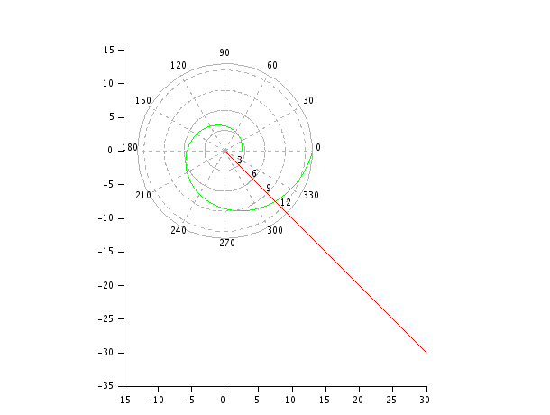
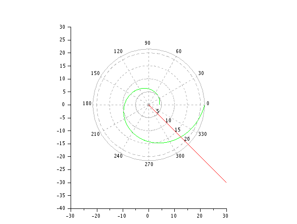

## Выполнила 
Попова Юлия Дмитриевна 1032192876 НФИбд-03-19

## Цель работы

Построить математические модели в Scilab, ознакомиться с задачей о погоне.

## Задание работы

- Запишите уравнение, описывающее движение катера, с начальными
условиями для двух случаев (в зависимости от расположения катера
относительно лодки в начальный момент времени).
- Постройте траекторию движения катера и лодки для двух случаев.
- Найдите точку пересечения траектории катера и лодки 

## Теоретическое введение

**Scilab** - пакет прикладных математических программ, предоставляющий открытое окружение для инженерных и научных расчётов.

## Выполнения работы
Уравнение, решение которого является траекторией движения катера в поялрных координатах: 
$$\frac{dr}{d\theta}=\frac{r}{\sqrt{14.21}}$$
Начальные условия для первого случая: $\begin{cases}
\theta_0=0 \\
r_0=118/49
\end{cases}$
Начальные условия для второго случая: $\begin{cases}
\theta_0=-\pi \\
r_0=118/28
\end{cases}$

## Траектория движения в первом случае

Точка пересечения траекторий в первом случае (-7.5, 7.5)

## Траектория движения во втором случае

Точка пересечения траекторий во втором случае (-11.5, 11.5)

## Заключение
 - Построили математические модели в Scilab.
 - Ознакомилисб с задачей о погоне.

## Библиография

1. Wikipedia: Scilab (https://ru.wikipedia.org/wiki/Scilab)

