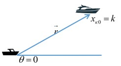
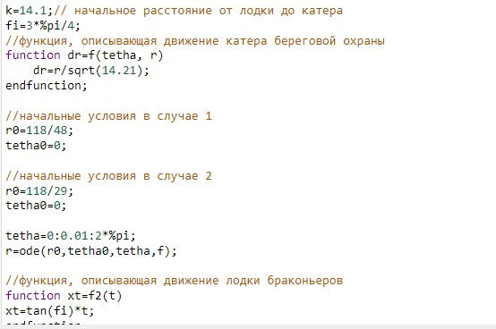
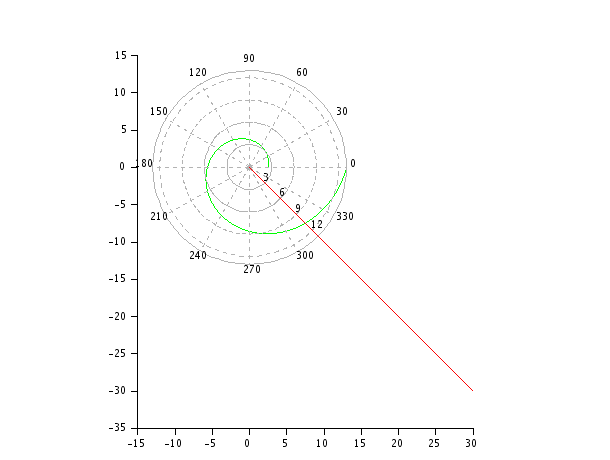
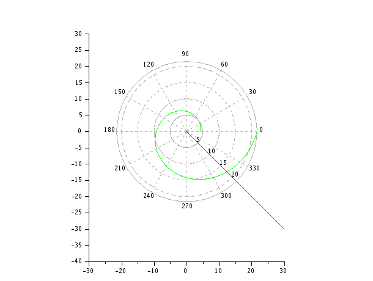

## Выполнила 
Попова Юлия Дмитриевна 1032192876 НФИбд-03-19

# Цель работы
Построить математические модели в Scilab на примере "Задаче о погоне".

# Задание работы

**Вариант 37**

На море в тумане катер береговой охраны преследует лодку браконьеров.
Через определенный промежуток времени туман рассеивается, и лодка
обнаруживается на расстоянии 14,1 км от катера. Затем лодка снова скрывается в
тумане и уходит прямолинейно в неизвестном направлении. Известно, что скорость
катера в 3,9 раза больше скорости браконьерской лодки.
1. Запишите уравнение, описывающее движение катера, с начальными
условиями для двух случаев (в зависимости от расположения катера
относительно лодки в начальный момент времени).
2. Постройте траекторию движения катера и лодки для двух случаев.
3. Найдите точку пересечения траектории катера и лодки

# Теоретичсекое введение

**Scilab** - пакет прикладных математических программ, предоставляющий открытое окружение для инженерных и научных расчётов.

# **Выполнение лабораторной работы**

## **Постановка задачи**
1. Принимаем за $t_0 = 0$, $x_{л0} = 0$ - место нахождения лодки браконьеров в
момент обнаружения, $x_{k0} = k$ - место нахождения катера береговой охраны
относительно лодки браконьеров в момент обнаружения лодки.

2. Введем полярные координаты. Считаем, что полюс - это точка обнаружения
лодки браконьеров  $x_{л0}$ ($\theta$=$x_{л0}=0$), а полярная ось $r$ проходит через точку нахождения катера береговой охраны (рис.1)

3. Траектория катера должна быть такой, чтобы и катер, и лодка все время
были на одном расстоянии от полюса $\theta$, только в этом случае траектория
катера пересечется с траекторией лодки.
Поэтому для начала катер береговой охраны должен двигаться некоторое
время прямолинейно, пока не окажется на том же расстоянии от полюса, что
и лодка браконьеров. После этого катер береговой охраны должен двигаться
вокруг полюса удаляясь от него с той же скоростью, что и лодка
браконьеров.
4. Чтобы найти расстояние
$x$
(расстояние после которого катер начнет
двигаться вокруг полюса), необходимо составить простое уравнение. Пусть
через время
$t$
катер и лодка окажутся на одном расстоянии
$x$
от полюса. За
это время лодка пройдет
$x$, а катер $k - x$ (или $k + x$, в зависимости от
начального положения катера относительно полюса). Время, за которое они
пройдут это расстояние, вычисляется как
$x / v$
или ($k - x)/ 3.9v$ (во втором
случае ($k + x)/ 3.9v$). Так как время одно и то же, то эти величины одинаковы.
Тогда неизвестное расстояние
$x$ можно найти из следующего уравнения:

$$\frac{x}{v}=\frac{k-x}{3.9v}$$
в первом случае или 
$$\frac{x}{v}=\frac{k+x}{3.9v}$$
во втором. Отсюда мы найдем два значения $x_1 = 118/49$, $x_2 = 118/29$, задачу будем решать для
двух случаев.

5. После того, как катер береговой охраны окажется на одном расстоянии от
полюса, что и лодка, он должен сменить прямолинейную траекторию и
начать двигаться вокруг полюса удаляясь от него со скоростью лодки $v$. Для этого скорость катера раскладываем на две составляющие:
$v_r$ - радиальная скорость и
$v_t$ - тангенциальная скорость (рис. 2). Радиальная
скорость - это скорость, с которой катер удаляется от полюса, $v_r = \frac{dr}{dt}$. Нам
нужно, чтобы эта скорость была равна скорости лодки, поэтому полагаем $\frac{dr}{dt} = v$.
Тангенциальная скорость – это линейная скорость вращения катера относительно полюса. Она равна произведению угловой скорости $\frac{d\theta}{dt}$ на радиус $r$, $v_\tau=\frac{d\theta}{dt}$ 

    

Из рисунка видно: $v_\tau=\sqrt{3.9v^2 - v^2}=\sqrt{14.21}v$ (учитывая, что радильная скорость равна $v$). Тогда получаем $r\frac{d\theta}{dt}=\sqrt{14.21}v$

6. Решение исходной задачи сводится к решению системы из двух дифференциальных уравнений:
$\begin{cases}
\frac{dr}{dt}=v
r\frac{d\theta}{dt}=\sqrt{14.21}v
\end{cases}$
с начальными условиями:
$\begin{cases}
\theta_0=0 \\
r_0=x_1
\end{cases}$
или 
$\begin{cases}
\theta_0=-\pi \\
r_0=x_2
\end{cases}$

где $x_1=118/49$, $x_1=118/29$.

Исключая из полученной системы производную по t, можно перейти к
следующему уравнению:
$$\frac{dr}{d\theta}=\frac{r}{\sqrt{14.21}}$$
Начальные условия остаются прежними. Решив это уравнение, мы получим
траекторию движения катера в полярных координатах.

## **Реализация в Scilab**
Решение дифференциального уравнения в Scilab

Точка пересечения траекторий в первом случае (-7.5, 7.5)

Точка пересечения траекторий во втором случае (-11.5, 11.5)

# Вывод

Научились строить математические модели в Scilab на примере "Задаче о погоне".

# Библиография

1. Wikipedia: Scilab (https://ru.wikipedia.org/wiki/Scilab)
