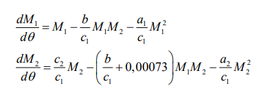

<!-- _class: titleslide -->

#### РОССИЙСКИЙ УНИВЕРСИТЕТ ДРУЖБЫ НАРОДОВ
#### Факультет физико-математических и естественных наук  
#### Кафедра прикладной информатики и теории вероятностей 
#### ПРЕЗЕНТАЦИЯ ПО ЛАБОРАТОРНОЙ РАБОТЕ №7

###### дисциплина: Математическое моделирование
###### Преподователь: Кулябов Дмитрий Сергеевич
###### Студент: Попова Юлия Дмитриевна
###### Группа: НФИбд-03-19
МОСКВА
2022 г.

---

# **Прагматика выполнения лабораторной работы**

- знакомство с моделью эффективности рекламы

- работа с OpenModelica

---

# **Цель работы**

Построение модели эффективности рекламы

---

# Задачи выполнения лабораторной работы

**Вариант 37**

Для уравнений эффективности рекламы:
 

Постройте графики распространения рекламы. При этом объем аудитории $N = 1140$, в начальный момент о товаре знает $10$ $человек$. Для случая 2 определите в какой момент времени скорость распространения рекламы будет иметь максимальное значение.

---

# **Выполнение лабораторной работы**

**_Построение модели эффективности рекламы_**

Уравнения для модели варианта-37:

 

# Первый график

Чтобы построить график распространения информации о товаре с учетом платной рекламы и с учетом сарафанного радио для первого уравнения, написали следующий код:

 
 и получили график:
  

---
# Второй график

Чтобы построить график распространения информации о товаре с учетом платной рекламы и с учетом сарафанного радио для второго уравнения, написали следующий код:

 

 и получили график:

  

---

# Третий график
Чтобы построить график распространения информации о товаре с учетом платной рекламы и с учетом сарафанного радио для третьего уравнения, написали следующий код:

 

 и получили график:
  

---

# Выводы

Научились выполнять построение модели распространения информации о товаре с учетом платной рекламы и с учетом сарафанного радио в OpenModelica.

---