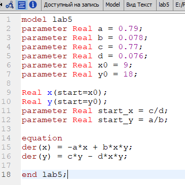
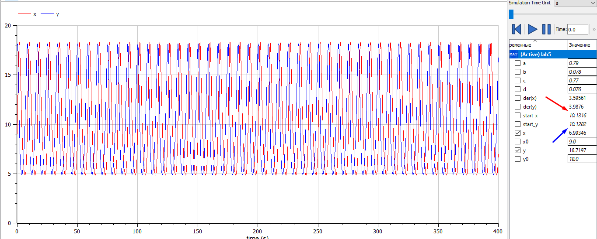
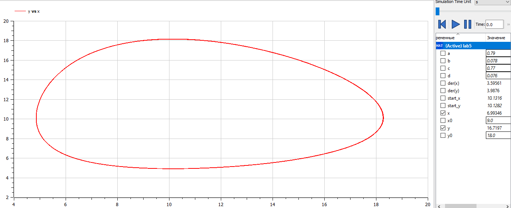

---
# Front matter

# Generic otions
lang: ru-RU
toc-title: "Содержание"

# Bibliography
bibliography: bib/cite.bib
csl: pandoc/csl/gost-r-7-0-5-2008-numeric.csl

# Pdf output format
toc: true # Table of contents
toc_depth: 2
lof: true # List of figures
lot: true # List of tables
fontsize: 12pt
linestretch: 1.5
papersize: a4
documentclass: scrreprt
## I18n
polyglossia-lang:
  name: russian
  options:
	- spelling=modern
	- babelshorthands=true
polyglossia-otherlangs:
  name: english
### Fonts
mainfont: PT Serif
romanfont: PT Serif
sansfont: PT Sans
monofont: PT Mono
mainfontoptions: Ligatures=TeX
romanfontoptions: Ligatures=TeX
sansfontoptions: Ligatures=TeX,Scale=MatchLowercase
monofontoptions: Scale=MatchLowercase,Scale=0.9
## Biblatex
biblatex: true
biblio-style: "gost-numeric"
biblatexoptions:
  - parentracker=true
  - backend=biber
  - hyperref=auto
  - language=auto
  - autolang=other*
  - citestyle=gost-numeric
## Misc options
indent: true
header-includes:
  - \linepenalty=10 # the penalty added to the badness of each line within a paragraph (no associated penalty node) Increasing the value makes tex try to have fewer lines in the paragraph.
  - \interlinepenalty=0 # value of the penalty (node) added after each line of a paragraph.
  - \hyphenpenalty=50 # the penalty for line breaking at an automatically inserted hyphen
  - \exhyphenpenalty=50 # the penalty for line breaking at an explicit hyphen
  - \binoppenalty=700 # the penalty for breaking a line at a binary operator
  - \relpenalty=500 # the penalty for breaking a line at a relation
  - \clubpenalty=150 # extra penalty for breaking after first line of a paragraph
  - \widowpenalty=150 # extra penalty for breaking before last line of a paragraph
  - \displaywidowpenalty=50 # extra penalty for breaking before last line before a display math
  - \brokenpenalty=100 # extra penalty for page breaking after a hyphenated line
  - \predisplaypenalty=10000 # penalty for breaking before a display
  - \postdisplaypenalty=0 # penalty for breaking after a display
  - \floatingpenalty = 20000 # penalty for splitting an insertion (can only be split footnote in standard LaTeX)
  - \raggedbottom # or \flushbottom
  - \usepackage{float} # keep figures where there are in the text
  - \floatplacement{figure}{H} # keep figures where there are in the text
---

<h1 align="center">

РОССИЙСКИЙ УНИВЕРСИТЕТ ДРУЖБЫ НАРОДОВ 

Факультет физико-математических и естественных наук  

Кафедра прикладной информатики и теории вероятностей

ОТЧЕТ ПО ЛАБОРАТОРНОЙ РАБОТЕ №5
  
<h2  align="right">

Дисциплина: Математическое моделирование

Преподаватель: Кулябов Дмитрий Сергеевич

Студент: Попова Юлия Дмитриевна

Группа: НФИбд-03-19
  
  
<h1 align="center">

МОСКВА

2022 г.
</h1>

# Цель работы
Рассмотреть модель модель "Хищник-Жертва".

# Задание работы

**Вариант 37**
Для модели «хищник-жертва»:
$$\frac{dx}{dt}= -0.79x(t) + 0.078x(t)y(t)$$
$$\frac{dy}{dt}= 0.77x(t) - 0.076x(t)y(t)$$
Построить график зависимости численности хищников от численности жертв, а также графики изменения численности хищников и численности жертв при следующих начальных условиях: $x_0 = 9$ $y_0 = 18$.

Найти стационарное состояние системы.

# Теоретичсекое введение
Система «хищник — жертва» — сложная экосистема, для которой реализованы долговременные отношения между видами хищника и жертвы, типичный пример коэволюции.

Отношения между хищниками и их жертвами развиваются циклически, являясь иллюстрацией нейтрального равновесия [1].

Данная двувидовая модель основывается на
следующих предположениях:
1. Численность популяции жертв x и хищников y зависят только от времени
(модель не учитывает пространственное распределение популяции на
занимаемой территории)
2. В отсутствии взаимодействия численность видов изменяется по модели
Мальтуса, при этом число жертв увеличивается, а число хищников падает
3. Естественная смертность жертвы и естественная рождаемость хищника
считаются несущественными
4. Эффект насыщения численности обеих популяций не учитывается
5. Скорость роста численности жертв уменьшается пропорционально
численности хищников

$$\frac{dx}{dt}= -a*x(t) - b*x(t)y(t)$$
$$\frac{dy}{dt}= -c*x(t) + d*x(t)y(t)$$

В этой модели $x$ – число жертв, $y$ - число хищников. Коэффициент $a$ описывает скорость естественного прироста числа жертв в отсутствие хищников, $с$ - естественное вымирание хищников, лишенных пищи в виде жертв.

Стационарное состояние системы (положение равновесия, не зависящее
от времени решение) будет в точке:
$x_0 = c/d$, $y_0 = a/b$.
При малом отклонении от положения
равновесия численности как хищника, так и жертвы с течением времени не
возвращаются к равновесным значениям, а совершают периодические колебания
вокруг стационарной точки. 

# **Выполнение лабораторной работы**

**_Построение модели Лотки-Вольтерры "хищник-жертва"_**

Построение модели «хищник-жертва»:

Чтобы построить фазовый портрет модели, написали следующий код:

Получили фазовый портрет модели в варианте для обычной системы, зависящей от времени:

Где стационарное состояние системы равно:
x = 10.1316
y = 10.1282

И фазовый портрет модели в варианте для параметрической системы:

# Вывод

Мы рассмотрели и построили модель Хищник-Жертва"".

# Библиография

1. Система "Хищник-Жертва"- https://ru.wikipedia.org/wiki/%D0%A1%D0%B8%D1%81%D1%82%D0%B5%D0%BC%D0%B0_%C2%AB%D1%85%D0%B8%D1%89%D0%BD%D0%B8%D0%BA_%E2%80%94_%D0%B6%D0%B5%D1%80%D1%82%D0%B2%D0%B0%C2%BB
